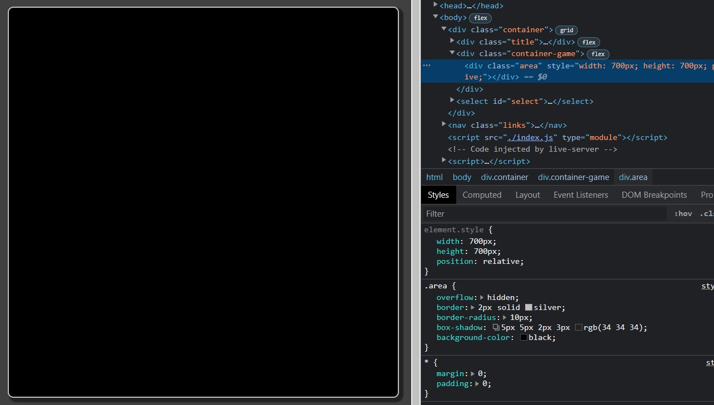
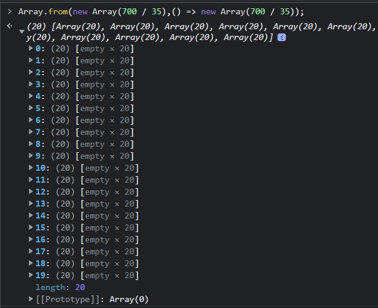
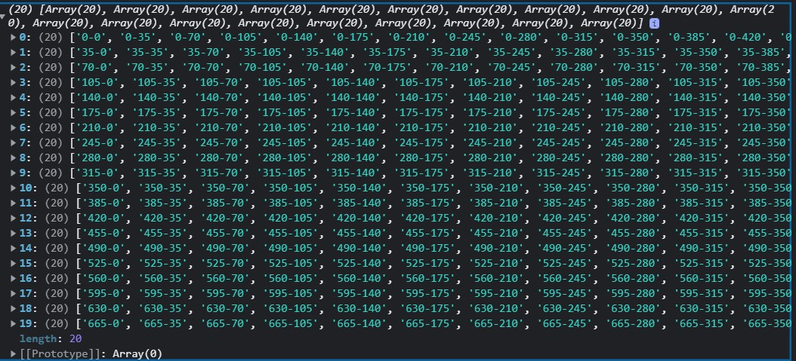

# Snake Game: explicación

## Introducción:

En este README explicaré cada parte del código javascript para la funcionabilidad de este juego. Sin embargo, por cada parte que vayas leyendo te invito a mirar el código original e ir juntándolo con los demás módulos para una mejor comprensión.

Trataré de explicarlo de la mejor manera, cualquier duda que tengas o recomendación para el código podés hacerla en mi correo: agusromero0815@gmail.com o a mi [red social](https://www.instagram.com/agusromero159/).

## Cómo diseñé el juego:

Para empezar, al principio mi problema no era la lógica que tendría este juego sino cómo plasmarlo en el contenido HTML. Hay varias formas de realizarlo, una de ellas es con canvas. Pero debido a que mi conocimiento de ese elemento es nulo, he decidido usar puros elementos de bloque. Es decir, los divs.

## Crear tablero

Lo primero que debemos hacer es crear el área donde nuestra `snake` se movera, te recomiendo utilizar las mismas medidas de altura que anchura, pero sos libre de hacerlo a tu gusto.

```javascript
//index.js

document.addEventListener("DOMContentLoaded", () => App(700, 35, 35));
```

Vemos que en nuestro archivo index solo tenemos una línea la cual agrega un evento al `document`. Una vez que el contenido del DOM se haya cargado ejecutará la función App pasándole tres argumentos: el primero será la ancho\*altura del tablero, ese número será tomado en pixeles. El segundo argumento representa el tamaño de cada "celda" o "cubo" de nuestra `snake`, también en pixeles. Por último el tercero para saber cuántos pixeles se moverá la `snake` (puede ser un número distinto del tamaño por celda pero es recomendable que sean el mismo).

```javascript
//App.js

export default function (sizeOfBoard, size, move) {
  const d = document,
    $board = d.querySelector(".area");

  const LEFT = "LEFT",
    UP = "UP",
    RIGHT = "RIGHT",
    DOWN = "DOWN";

  let delay = 100,
    direction = RIGHT;

  $board.style.width = `${sizeOfBoard}px`;
  $board.style.height = `${sizeOfBoard}px`;
  $board.style.position = "relative";
  ...
```

Veamos qué está ocurriendo aquí. La constante `d` guarda una referencia del `document` con el fin de usar solo esa letra a la hora de querer utilizar el objeto `document`. Simplemente por comodidad.

Después obtenemos nuestro tablero del DOM. El tablero no es más que un div con la clase `area`.

Declaramos cuatro constantes que serán las direcciones en las que podrá elegir la `snake` para recorrer el tablero. Podés omitir este paso y usar cadenas de string a la hora de utilizarlas, pero yo prefiero tenerlas guardadas de esta manera.

Declaramos dos variables muy importantes `delay` y `direction`, como su nombre bien lo dice, una nos permitirá definir cada tantos milisegundos se movera nuestra `snake` y otra a qué dirección. En el caso de `delay` está representado en milisegundos, por lo que 100 sería un 1/10 de un 1s. En el caso de `direction` la podés inicializar con otro valor distintos de RIGHT, pero te recomiendo ese. Ambas están inicializadas con `let` porque mutarán a lo largo del código.

Por último tenemos la creación del tablero. Agarramos nuestro div del DOM `$board` y en su contenido width y height interpolamos con template strings la variable `sizeOfBoard`(700 en nuestro caso). Es importante la última línea la cual hace que la posición del div sea relative, este será uno de los trucos con los cuales podremos mover la `snake` a nuestro gusto por el tablero.

Si le das un background-color al div ya deberías tener un cuadro de 700px\*700px en tu DOM.



## Modo de elección

```javascript
//App.js

let snake = [],
  positions = Array.from(
      new Array(sizeOfBoard / size),
      () => new Array(sizeOfBoard / size)
    );

setPositions(positions, size);

const chooseDirection = (e) => {
  d.removeEventListener("keydown", chooseDirection);

  if (e.key === "ArrowLeft" && direction !== RIGHT) return (direction = LEFT);

  if (e.key === "ArrowUp" && direction !== DOWN) return (direction = UP);

  if (e.key === "ArrowRight" && direction !== LEFT) return (direction = RIGHT);

  if (e.key === "ArrowDown" && direction !== UP) return (direction = DOWN);
};

...
```

Como dije anteriormente, haremos que la snake se forme a través de tantos divs con el tamaño de la variable `size`, para tener todos esos divs juntos y en ORDEN (importante eso), decidí declarar un arreglo `snake` donde se alojarán esos divs. Por otro lado declaro otro arreglo `positions`, el cual servirá para ver adónde puede posicionarse la futura comida, ya que no puede ser en un lugar donde alguna celda de la snake se encuentre allí.

Por eso realizo un array de dos dimensiones con el método from() del objeto _Array_. El método from acepta dos argumentos: el primero será un objeto iterable, en este caso será un array de `sizeOfBoard`(700) / `size`(35), es decir tendrá una longitud de 20 elementos. El segundo argumento es una función callback que la usará para llenar el contenido del objeto iterable. En mi caso por cada elemento del arreglo hice otro con la misma ecuación. Por lo que terminaría teniendo un arreglo de longitud 20 donde cada uno también tiene una longitud de 20. Ahora tengo todas las celdas disponibles que hay en mi tablero. Creo que ahora se entiende por qué recomendaba que la altura sea la misma que la anchura. Y otra cosa importante es que el `size` debe ser divisible por el tamaño del tablero `700 % 35 === 0`, ya que nos dará la longitud exacta para cada movimiento y no tendremos problemas con la dimensión de nuestro array ya que tendremos números enteros (más adelante profundizaremos en esto).



```javascript
//setPositions.js

export default function (positions, size) {
  let top = 0;
  for (let i = 0; i < positions.length; i++) {
    let left = 0;
    for (let j = 0; j < positions[0].length; j++) {
      positions[top / size][left / size] = `${top}-${left}`;
      left += size;
    }
    top += size;
  }
}
```

Bueno, veamos qué hace **_setPositions_**. Como vimos anteriormente, recibe como parámetros la referencia a la matriz-array `positions` y `size`. Basicamente como tenemos una matriz, es decir, un array de una dimension doble, necesitaremos dos bucles anidados para recorrer cada uno de los elementos. El primer bucle hará referencia al array de 20 arrays, el segundo bucle será el que iterará sobre los elementos de esos array. Ahora, para qué quiero iterar sobre cada elemento ? Bueno, la idea principal es rellenarlo con todas las coordenadas posibles que existen en nuestro tablero. Esto lo podés ver como un claro gráfico donde X es left e Y es right.

Quiero que te fijes que para acceder a la posición de un elemento hago `[top / size][left / size]` los divido por la misma cantidad que también los voy sumando, eso me va a dar un indice para indicar la coordenada:

```javascript
/*
left = 0;
top = 0;
size --> 35
coordenada --> `${top}-${left}`

positions[0 / 35 --> 0][0 / 35 --> 0] = "0-0" --> positions[0][0] = "0-0"

sumamos --> top = 0, left = 35

positions[0 / 35 --> 0][35 / 35 --> 1] = "0-35" --> positions[0][1] = "0-35"

sumamos --> top = 0, left = 70

positions[0 / 35 --> 0][70 / 35 --> 2] = "0-70" --> positions[0][2] = "0-70"

y así sucesivamente...
*/
```

Como `move` (la cantidad de pixeles que se desplaza la snake) es igual a `size`, entonces hago toda esta operación para saber todas ubicaciones que puede pasar mi snake. Terminaría quedando una matriz con las coordenadas tal que así:



Más adelante veremos cómo manipularlo y utilizarlo a nuestro favor para saber dónde está nuestra snake y adónde ubicar su comida.

Muy bien, es momento de ver cómo podemos hacer cambiar la dirección de la variable `direction`. Para eso creé la función **_chooseDirection_**, ésta será llamada cuando ocurra el evento "keydown" y accediendo al evento que llega por parámetro, en su propiedad `key`, puedo ver si la tecla es de las cuatro que me interesa, si es una de ellas, corto la ejecución de la función con un **_return_** y reasigno a `direction` con su nueva dirección.

Ahora, puede que te estés haciendo algunas preguntas, como qué hace ese removeEventListener y la condición después de cada && en los Ifs. Bueno, empecemos por la segunda. Como bien sabemos en el juego de la snake siempre es posible moverse hacia la dirección que uno quiera, excepto a la contraria de donde estoy apuntado, ya que ello induciría a un choque instantáneo con el cuerpo de la propia snake y perdería. Por lo que irse a la dirección opuesta de la actual está prohibido. Es así que cuando el jugador aprieta la tecla "left", primero tengo que verificar que su snake no esté apuntando a "right", ya que sino todo su cuerpo restante estará esperando ansioso por una buena colisión ☠️. De ser así, se cancela la condición del if sin ejecutarse la acción.

Por otro lado, la parte del removeEventListener no es que sea permanente, de hecho el jugador no lo llegará a notar a ojo, simplemente es para que no se produzca otro bug de colisión el cual te explicaré más adelante cuando veamos más sobre la mecánica.

## Start Game

```javascript
//App.js

const startGame = (e) => {
  if (e.key === " ") {
    initializeGame($board, snake, size, move);
    game();
    d.querySelector(".score").textContent = 0;
    d.addEventListener("keydown", chooseDirection);
    d.removeEventListener("keydown", startGame);
  }
};
```

```javascript
//initializeGame.js

export default function ($board, snake, size, move) {
  $board.innerHTML = "";

  const $cubo1 = makeLink(size, 0, move, "rgb(225, 40, 40)", "head");
  const $cubo2 = makeLink(size, 0, 0, "rgb(240, 10, 10)");

  $board.appendChild($cubo1);
  $board.appendChild($cubo2);

  snake.push($cubo1);
  snake.push($cubo2);
}
```

```javascript
//makeLink.js

export default function (size, top, left, color, addClass) {
  const s = document.createElement("div");
  s.style.width = `${size}px`;
  s.style.height = `${size}px`;
  s.style.backgroundColor = color;
  s.style.position = "absolute";
  s.style.top = `${top}px`;
  s.style.left = `${left}px`;

  addClass && s.classList.add(addClass);

  return s;
}
```

Mirá todo el código detalladamente. Primero tenemos una función **_startGame_** que también va a ser utilizada como callback en un evento de "keydown", y su bloque if solo se ejecutará cuando el jugador presione el espacio.

Cuando se presione el espacio se ejecutará el **_initializeGame_**. Reinicia todo el contenido HTML del tablero (la primera vez no tiene sentido porque no hay nada pero esto es para futuros ciclos de jugadas donde se necesite borrar lo anterior). Crea dos "cubos" o "celdas" a través de la función **_makeLink_**. Esta función será la que creará estas primeras ileras de la snake y las futuras. Acepta el `size` y otras dos variables más que serán el top y left.

### Movimiento de la snake

Ya que hablamos de los parámetros top y left veamos cómo se movera nuestra snake: La razón por la cual hicimos nuestro trablero con posicionamiento "relative" es porque cualquier hijo que tenga el div y posea un posicionamiento "absolute", lo sacará de su modelo de caja y adoptará a la de su padre. Siendo así que `top: 0 y left: 0` dejará a nuestro cubo en la esquina superior izquierda.

```javascript
//initializeGame.js

const $cubo1 = makeLink(size, 0, move, "rgb(225, 40, 40)", "head");
const $cubo2 = makeLink(size, 0, 0, "rgb(240, 10, 10)");

$board.appendChild($cubo1);
$board.appendChild($cubo2);

//makeLink.js

s.style.top = `${top}px`;
s.style.left = `${left}px`;

addClass && s.classList.add(addClass);

return s;
```

En el caso del cubo1 tendrá una posición `top: 0, left: 35` y cubo2 `top: 0, left: 0`. Es así que nosotros tendremos que saber qué coordenadas queremos darle a **_makeLink_** para posicionar nuestro cubo. Después utilizamos el método **appendChild** para meter los cubos en el tablero.

Además de meter los cubos al tablero, coloco de igual forma los cubos en el arreglo snake a través del método push. Esto es muy importante porque snake la recibo como parámetro en la función, por lo tanto estoy con una referencia de snake. Es importante no reinicializarla porque perderemos ese vínculo con el arreglo.

Una vez que ha terminado de hacer lo suyo **_initializeGame_** sigue la función **_game_**, hablaremos de ella en el próximo apartado. Tengo un elemento `p` con la clase "score", me lo traigo del DOM e inicializo su contenido textual en 0, será el contador de la comidas recogidas.

Como se ha inicializado el juego le agrego otro evento "keydown" al `document` pero la paso como callback la función **_chooseDirection_** que ya vimos qué hace. Después de hacer todo eso no hay necesidad de que startGame siga activo por si el usuario vuelve a presionar "espacio", entonces removemos el evento del `document` (si te das cuenta, es lo mismo que hacemos con chooseDirection cuando se activa).

### Pequeño apartado para hablar sobre los removeEventListeners

Mucha gente sabe cómo añadir eventos al DOM pero no saben cómo se remueven, y es que un elemento puede tener multiples eventos, incluso del mismo tipo!!! Entonces... ¿Cómo hago para que sepa cúal remover? Bueno, esta es la razón por la que las funciones callbacks de mis eventos las guardo en variables. Y es que al usar removeEventListener necesitamos poner el tipo de evento que queremos remover y como segundo argumento la referencia a esa función a la que se le había asociado. Es así que yo puedo tener varios eventos "keydown" asociados al `document` pero con funciones específicas y no anónimas, para poder removerlas futuramente. Te invito a que vuelvas a observar la función **_startGame_** para poder entenderlo.

## Game

```javascript
//App.js

const game = () => {
  let interval = setInterval(() => {
    let prevHeadLeft = +snake[0].style.left.slice(0, -2),
      prevHeadTop = +snake[0].style.top.slice(0, -2),
      aux1 = [`${prevHeadTop}px`, `${prevHeadLeft}px`];

    const $food = d.querySelector("#food");

    switch (direction) {
      case LEFT:
        snake[0].style.left = `${prevHeadLeft - move}px`;
        break;
      case UP:
        snake[0].style.top = `${prevHeadTop - move}px`;
        break;
      case RIGHT:
        snake[0].style.left = `${prevHeadLeft + move}px`;
        break;
      case DOWN:
        snake[0].style.top = `${prevHeadTop + move}px`;
        break;
    }

    d.addEventListener("keydown", chooseDirection);

    for (let cube of snake.slice(1)) {
      cube = cube.style;
      let aux2 = [cube.top, cube.left],
        cubeTop = +cube.top.slice(0, -2),
        cubeLeft = +cube.left.slice(0, -2);

      positions[cubeTop / size][cubeLeft / size] = false;

      cube.top = aux1[0];
      cube.left = aux1[1];
      aux1 = aux2;
    }

    let headLeft = +snake[0].style.left.slice(0, -2),
      headTop = +snake[0].style.top.slice(0, -2);

    if (headTop < 0 || headTop > sizeOfBoard - size) return gameOver(interval);
    if (headLeft < 0 || headLeft > sizeOfBoard - size) return gameOver(interval);
    if (positions[headTop / size][headLeft / size] === false) return gameOver(interval);

    positions[headTop / size][headLeft / size] = false;

    let top = +aux1[0].slice(0, -2),
      left = +aux1[1].slice(0, -2);

    positions[top / size][left / size] = `${top}-${left}`;

    checkFood(snake, $food, $board, positions, headTop, headLeft, size);

    snake.length >= (sizeOfBoard / size) ** 2 - 2 && gameOver(interval, true);
  }, delay);
};

//checkFood

export default function checkFood(snake, $food, $board, positions, headTop, headLeft, size) {
  if (!$food)
    return $board.appendChild(generateFood(positions, sizeOfBoard, size, move));

  if ($food.style.top + $food.style.left === `${headTop}px${headLeft}px`) {
    eatFood($board, snake, headTop, headLeft, size);
    $board.removeChild($food);
  }
}

//generateFood.js
export default function (positions, size) {
  let top, left;

  let filerPositions = [];

  positions.forEach(
    (arr) =>
      (filerPositions = [...filerPositions, ...arr.filter((item) => item)])
  );

  [top, left] =
    filerPositions[Math.floor(Math.random() * filerPositions.length)].split(
      "-"
    );

  const $food = makeLink(size, top, left, "blue");
  $food.id = "food";

  return $food;
}

//eatFood.js

export default function ($board, snake, top, left, size) {
  const cuboTemp = makeLink(size, top, left, "rgb(240, 10, 10)");
  $board.appendChild(cuboTemp);
  snake.push(cuboTemp);
  document.querySelector(".score").textContent =
    +document.querySelector(".score").textContent + 1;
}

//App.js

const gameOver = (interval, theWinner) => {
    clearInterval(interval);
    setPositions(positions, size);
    d.removeEventListener("keydown", chooseDirection);
    snake = [];
    direction = RIGHT;
    const $gameOver = d.createElement("p");
    $gameOver.className = "game-over";
    $gameOver.textContent = `Game Over! Score: ${
      d.querySelector(".score").textContent
    }`;

    if (theWinner) $gameOver.textContent = "YOU'RE GOD";
    $board.appendChild($gameOver);

    d.addEventListener("keydown", startGame);
  };
```

Tal vez pienses que es un lío imposible de comprender pero tranqui, se puede. En primer lugar tenemos una función llamada **_game_**, ésta lo único que hace es inicializar una variable llamada `interval` la cual crea un setInterval. Como bien sabemos setInterval acepta en su primer argumento una callback y en el segundo el tiempo de espera en milisegundos para ejecutar la función cada tanto. En este caso estamos usando `delay` para hacerle saber que cada 100 milisegundos se ejecute la callback. Ahora veamos qué hace la callback:

En definitiva estamos ante el corazón de nuestro juego, será quien actualizará cada movimiento de nuestra snake (en este caso cada 100 ms). Dividamos nuestro código en fragmentos.

```javascript
let prevHeadLeft = +snake[0].style.left.slice(0, -2),
  prevHeadTop = +snake[0].style.top.slice(0, -2),
  aux1 = [`${prevHeadTop}px`, `${prevHeadLeft}px`];
```

Atento a la expresión `snake[0].style.left` aquí simplemente le estamos diciendo que nos devuelva el `left` de el primer cubo de snake. Nos dará N número + px, ej: "10px". Pero a mí solo me interesa el número y en tipo de dato _number_, por lo que primero le hago `.slice(0, -2)` esto si se lo aplicamos a un string me devolverá todos los carácteres excepto los últimos dos, justamente lo que buscaba!! Y como sabemos que tanto `left` como `top` van a tener siempre "px" podemos estar seguros que siempre vamos a querer todos los carácteres del string menos los últimos 2. Y por si no sabías, si tenés un string que es un número con ponerle un + adelante sin sumarlo a nada, por coerción de datos se pasará a _number_.

Por otro lado me guardo la posición del cubo head en una variable llamada `aux1`. Esto es debido a que el valor de la head lo actualizaremos enseguida pero voy a requerir de la posición previa para otros cálculos.

```javascript
...
const $food = d.querySelector("#food");

switch (direction) {
  case LEFT:
    snake[0].style.left = `${prevHeadLeft - move}px`;
    break;
  case UP:
    snake[0].style.top = `${prevHeadTop - move}px`;
    break;
  case RIGHT:
    snake[0].style.left = `${prevHeadLeft + move}px`;
    break;
  case DOWN:
    snake[0].style.top = `${prevHeadTop + move}px`;
    break;
}
...
```

Buscamos si existe en el DOM un elemento con el id "food" (en la primera llamada no estará por lo que será `null`), esto sirve para ver si hay comida en el tablero, si no la hay ya verás qué sucede próximamente.

Llegó el momento de ver cuando se actualiza la posición del head. Como verás el switch se basa en lo que tenga la variable `direction` es decir que será lo que el jugador haya presionado como última tecla. Si le elección es UP, entonces agarra el head con `snake[0]` busca la propiedad top y debe hacer top anterior menos movimiento (en este caso `move` era igual que `size`, es decir, 35). Acordate que `top: 0, left: 0` simboliza la esquina superior izquierda, siendo que las coordenas X es LEFT e Y es TOP. Si queremos subir entonces tenemos que restar top, si queremos bajar, hay que sumarle y viceversa con lo otro.

Bien, ya logramos que cada 100 ms nuestra cabeza se mueva y encima responde a las elecciones que presione el jugador!!!

Sé lo que te estás preguntando: "Bien, nuestra cabeza ya se mueve pero... y el resto del cuerpo? Y qué pasa si el usuario quiere subir y el top es 0? Y las colisiones con el mismo cuerpo de la snake ?" Bueno, vamos de a poco!!!

```javascript
...
d.addEventListener("keydown", chooseDirection);

    for (let cube of snake.slice(1)) {
      cube = cube.style;
      let aux2 = [cube.top, cube.left],
        cubeTop = +cube.top.slice(0, -2),
        cubeLeft = +cube.left.slice(0, -2);

      positions[cubeTop / size][cubeLeft / size] = false;

      cube.top = aux1[0];
      cube.left = aux1[1];
      aux1 = aux2;
    }
...
```

Te acordás que cuando el usuario apretaba una tecla en el evento "keydown" con la callback **_chooseDirection_** en la misma se eliminaba el evento con esa función ? Entonces, cuándo el jugador vuelve a tenér el evento con la función **_chooseDirection_**? Bueno, eso sucede después del switch en la callback del setInterval. Pensalo de este modo: `evento keydown para empezar el juego, si es espacio se inicia y se elimina el evento keydown con la función startGame` --> `se inicia un setInterval con 100ms llamándose la callback` --> `cuando el jugador apreta una tecla se remueve el evento keydown y si se eligió una direction válida se reestablece` --> `el evento vuelve a ser reestablecido una vez que en el setInterval haya pasado por el switch llegando a esa línea`.

Muy bien, ahora, por qué simplemente hacemos todo este ida vuelta y no dejamos el evento "keydown" del **_chooseDirection_** permanente, si total hasta que la función callback llegue al switch se podría elegir a qué `direction` ir. Esa es una muy buena lógica pero hay un caso del que nos estamos olvidando. Fijáte en la condición de los IFs del **_chooseDirection_** y la cantidad de `delay` en el setInterval. Es un tiempo pequeñísimo a ojo humano, pero el jugador puede llegar a romper el juego de una manera increíble!!! Recordá el principio por el cual pusimos las condiciones IFs después del &&. Exacto, para que no vaya a su contrario!! Pero supongamos que nuestra snake se encuentra apuntado a la dirección "RIGHT", claramente no podemos ir hacia el "LEFT" por cómo hicimos nuestras condiciones. Pero si el jugador apreta "UP" o "DOWN" y todavía no se ha efectuado la sumatoría de movimiento, puede a la vez en tiempo record apretar "LEFT"!! Y como `direction` es "UP" o "DOWN" no tendrá problemas en las condiciones con habilitar el cambio y PUM!! Como nuestra snake en ese tiempo record todavía estaba en el mismo lugar se chocara contra su propio cuerpo!!

Lo bueno es que una vez que el jugador haya apretado una tecla no podrá cambiar la `direction` después de que se realice el switch (la sumatoría de movimiento) y así evitar colisiones de ese tipo. El jugador ni se dará cuenta de que se removió el evento y el juego sigue funcionando perfectamente sin ese bug de colisión.

Si no me creés o tenés cierto escepticismo con lo que digo, te invito a que remuevas esas líneas donde remuevo el evento en **_chooseDirection_** y donde lo agrego en el setInterval. Verás que el juego continuará de igual manera pero si realizás esa maniobra maldita, tu snake se comerá a sí misma.

Ahora, acá llega la magia. Con el siguiente bucle for itero sobre cada uno de los "cubos" de mi snake, excepto el primero, ya que la head ya está actualizada, por eso hago `snake.slice(1)`. Como voy a estar usando la propiedad `style` de mis `cube` para acceder a `top` y `left` reasigno por cada iteración a `cube` como `cube.style` para acortar código. Ahora por cada `cube` voy a acceder a su propiedades `top` y `left` y asignarles la posición de su próximo. Pero OJO!! Esta es la razón por la que declaré `aux1` y le guardé las coordenadas del head. Ya que si hubiera accedido a las propiedades de head después del switch tendría la posición actual del head y no la anterior.

Así como guardamos las coordenadas previas a la actualización del head, hacemos lo mismo con el `cube` que estamos por actualizar, la guardamos en una variable llamada `aux2`.

```javascript
...
    cubeTop = +cube.top.slice(0, -2),
    cubeLeft = +cube.left.slice(0, -2);

  positions[cubeTop / size][cubeLeft / size] = false;
...
```

Ahora que estamos recorriendo el cuerpo de la snake y actualizando sus posiciones, es el momento perfecto para hacerle saber a nuestro `positions` qué lugares estamos ocupando en el segundo exacto. Es así que obtengo las coordenadas de tipo _number_ del `cube` iterando y utilizando la fórmula de dividir la coordenada por el `size` para obtener el indice en las posiciones, y ahí es cuando lo reasigno a _false_. Por qué _false_ ? Porque de esa manera filtraremos todas las `positions` disponibles a la hora de querer posicionar la futura comida.

```javascript
cube.top = aux1[0];
cube.left = aux1[1];
aux1 = aux2;
```

Por último le decimos que el `cube` iterando, en su posición `top` y `left` son las de `aux1` (que en primer lugar son las de head). Ahora para que `aux1` siga teniendo la posición del anterior en la próxima iteración, le decimos que `aux1` es `aux2` (que eran las cooredenadas previas del `cube` que acabamos de actualizar).

```javascript
let headLeft = +snake[0].style.left.slice(0, -2),
  headTop = +snake[0].style.top.slice(0, -2);

if (headTop < 0 || headTop > sizeOfBoard - size) return gameOver(interval);
if (headLeft < 0 || headLeft > sizeOfBoard - size) return gameOver(interval);
```

Después del bucle y una vez todos los `cube` en su lugar correspondiente obtenemos las coordenadas del head de tipo _number_ y ahora con los IFs posteriores verificamos si la head salió de nuestro tablero. En el caso de que el `top` o `left` sea menor a 0 o si su valor es mayor a `700` - `35`, porque ese es la última celda que puede ocupar un cubo en el final del ancho y de altura. Si fuera solo `700` eso le habilitaría al snake mover una celda más fuera del tablero y no queremos eso.

En el caso de que se cumpla las condiciones, paran la ejecución con _return_ y llaman a la función **_gameOver_** pasándole la variable interval que contiene el cuerpo del setInterval. Veremos que hace **_gameOver_** más adelante.

```javascript
if (positions[headTop / size][headLeft / size] === false)
  return gameOver(interval);

positions[headTop / size][headLeft / size] = false;

let top = +aux1[0].slice(0, -2),
  left = +aux1[1].slice(0, -2);

positions[top / size][left / size] = `${top}-${left}`;
```

Una vez finalizado el bucle falta una celda más a deshabilitar en `positions`, la del head. Pero primero debemos saber si en la posición nueva que está el head es una donde ya estaba ocupada, si es así significa que hubo una colisión con el propio cuerpo de la snake. Entonces la condición del if es igual a _true_ y paramos el código con _return_ y llamamos a **_gameOver_**. Si no es así de igual manera decimos que la celda ahora está siendo ocupada igualándola a _false_.

Genial!! Ya cubrimos los dos tipos de colisiones, por el tablero y por el propio cuerpo de la snake ✔️.

Hasta ahora hemos tenido éxito en decirle a `positions` las celdas donde está el cuerpo de la snake, pero en ningún momento le decimos cúando vuelve estar disponible una vez que la snake deja esa celda. Bueno, eso se puede solucionar muy fácil obteniendo las coordenadas de `aux1`. Recordemos que `aux1` iba a estar siendo reasignado para poseer aquellas coordenadas previas de los `cube` a través de `aux2`. Por lo que una vez que finalice el bucle, `aux1` tendrá las coordenadas PREVIAS (no actual) de la cola. Perfecto!! Entonces solo tenemos que reasignar esa celda y darle de nuevo las coordenadas que le corresponden con `` positions[top / size][left / size] = `${top}-${left}`; `` así haríamos que cada posición previa de la cola se actualice y vuelva a obtener la coordena correspondiente ✔️.

```javascript
//App.js
...
checkFood(snake, $food, $board, positions, headTop, headLeft, size);
...
//checkFood.js

export default function checkFood(
  snake,
  $food,
  $board,
  positions,
  headTop,
  headLeft,
  size
) {
  if (!$food)
    return $board.appendChild(generateFood(positions, sizeOfBoard, size, move));

  if ($food.style.top + $food.style.left === `${headTop}px${headLeft}px`) {
    eatFood($board, snake, headTop, headLeft, size);
    $board.removeChild($food);
  }
}
```

Ok, una vez actualizadas las `positions` llega el momento de chequear la comida, llamamos a la función **_checkFood_** y le pasamos varios parámetros, veamos que contenido tienen:

- snake --> _un arreglo con todos los divs (`cubes`) de la snake, donde el indice 0 representa la head_

- $food --> _Un elemento del DOM que se busca, en este caso es `null` porque no se encontró pero en futuras llamadas probablemente se encuentre_

- $board --> _Un div que es ni más y menos que el tablero_

- positions --> _Un array de dos dimensiones que tendrá todas las coordenadas de cada celda y las que están ocupadas_

- headTop --> _Coordenada top en tipo **number** de la head_

- headLeft --> _Coordenada left en tipo **number** de la head_

- size --> _Tamaño de cada cube de la snake, en este caso 35px_

Vemos que lo primero que hace la función es verificar si el $food existe, y si no existe entonces corta la ejecución con un _return_ y llama a ***generateFood*** y lo que devuelve como resultado se lo appendea a `$board`. Veamos qué hace **_generateFood_**:

```javascript
export default function (positions, size) {
  let top, left;

  let filerPositions = [];

  positions.forEach(
    (arr) =>
      (filerPositions = [...filerPositions, ...arr.filter((item) => item)])
  );

  [top, left] =
    filerPositions[Math.floor(Math.random() * filerPositions.length)].split(
      "-"
    );

  const $food = makeLink(size, top, left, "blue");
  $food.id = "food";

  return $food;
}
```

Como verás creo nuevas variables locales para tener coordenadas `top` y `left` de la comida, más un arreglo `filterPositions`. Como `positions` es un arreglo de dos dimensiones necesito recorrer el primero y después filtrar cada uno con los elementos verdaderos.

```javascript
filerPositions = [...filerPositions, ...arr.filter((item) => item)];
```

Sabemos que `arr` en nuestra callback para el _forEach_ será cada array de 20 elementos. Entonces por cada de uno de esos hago que `filterPositions` sea igual a un nuevo arreglo con todos los elementos que tenía `filterPositions` concatenado con los elementos de `arr` pero filtrado a solo elementos verdaderos. Es por esa razón que cuando una celda está ocupada le puse un valor _falsy_ y ya de por sí un string con al menos un carácter ya tenderá a verdadero.

Resultado: un nuevo arreglo plano con solo las posiciones no ocupadas. Perfecto!!!

```javascript
[top, left] =
  filerPositions[Math.floor(Math.random() * filerPositions.length)].split("-");
```

Ahora que ya tenemos un arreglo con solo posiciones desocupadas podemos buscar un indice aleatorio con _Math.floor_ para redondear el resultado hacia abajo, _Math.random()_ para generar un número aleatorio entre 0-1 muy largo y lo multiplicamos por la cantidad de elementos en nuestro array, de esa forma nos dará un indice en ese rango. Como sabemos que será un string de este estilo: `"35px-665px"` entonces solo hacemos _.split("-")_ para cortarlo en dos partes creando un array y se los asignamos a `top` y `left` con desestructuración.

```javascript
const $food = makeLink(size, top, left, "blue");
$food.id = "food";

return $food;
```

Ahora que tenemos las coordenadas de nuestra comida la generamos llamando a **_makeLink_**, ya visto anteriormente, y le digo que será de color "blue" para que sea distinto de la snake. Le asignamos el id "food" para que ahora sí la encuentre cuando la busque en el DOM, y no se ejecute todo este bloque del **_checkFood_**. Por último retornamos el elemento, el cual ya sabemos que va a ser appendeado en el `$board`.

OK! Ya creeamos nuestra comida. Pero... dentro de 100ms se volverá a ejecutar la callback del setInterval y, en difinitiva, se volverá a llamar **_checkFood_**. Veamos qué pasa ahora que `$food` no es un valor `null`.

```javascript
if ($food.style.top + $food.style.left === `${headTop}px${headLeft}px`) {
  eatFood($board, snake, headTop, headLeft, size);
  $board.removeChild($food);
}
```

Si el valor no es `null` no se ejecuta la parte de **_generateFood_** y se realiza la condición if de abajo. Verifica que tanto las coordenadas de le head sean iguales a las de la comida, si es así... chan chan!! Se ha recogido la comida por lo que la snake debe incrementarse. Llamamos a la función **_eatFood_** y removemos del `$board` el elemento `$food`. Veamos que hace **_eatFood_**:

```javascript
export default function ($board, snake, top, left, size) {
  const cuboTemp = makeLink(size, top, left, "rgb(240, 10, 10)");
  $board.appendChild(cuboTemp);
  snake.push(cuboTemp);
  document.querySelector(".score").textContent =
    +document.querySelector(".score").textContent + 1;
}
```

Como verás **_eatFood_** no tiene un código tan complejo. Simplemente crea otro `cube` con **_makeLink_**, le pasamos las coordenadas de la head. También podrías pasarle la de la cola pero es lo mismo. No habrá problemas de colisión porque el programa lo toma como si fueran los mismos. El cambio sucederá cuando se llame de nuevo la callcack de setInterval y se ejecute el bucle de `snake` dándole su nueva celda al `cube` añadido. Si te confunde porqué no hay colisión, recordá que es head quién determina si ha tocado una celda en _false_ y entonces concuerda que hubo colisión, y como el nuevo `cube` tiene la misma dirección que head pero no ha sido parte del bucle (aún) no tiene en la celda un _false_.

Por último incrementamos el `score` para ver la acumulación.

```javascript
snake.length >= (sizeOfBoard / size) ** 2 - 2 && gameOver(interval, true);
```

Ultima parte de la callback!! Este fragmento simplemente está para ver si el jugador es **DIOS SUPREMO** y ya ha logrado capturar todas las celdas posibles. Hagamos los cálculos:

Sabemos que nuestro tablero tiene un `700*700` y cada `cube` de nuestra snake es de `35`. Eso quiere decir que `700 / 35 = 20` por lo que tanto del alto como ancho puede haber una ilera de 20 `cubes`. Ahora hagamos el total que puede haber en el tablero: `20 * 20 = 400`, es decir, pueden haber en total `400 cubes` en el tablero (400 celdas). Yo decidí que no le haré sufrir tanto al jugador y que si le longitud es igual o mayor a 398 pare el juego. Y como estarás viendo, a **_gameOver_** no le paso solo `interval` como en las otras llamadas sino también otro argumento con un valor _true_. Próximamente veremos qué hace.

```javascript
const gameOver = (interval, theWinner) => {
  clearInterval(interval);
  setPositions(positions, size);
  d.removeEventListener("keydown", chooseDirection);
  snake = [];
  direction = RIGHT;
  const $gameOver = d.createElement("p");
  $gameOver.className = "game-over";
  $gameOver.textContent = `Game Over! Score: ${
    d.querySelector(".score").textContent
  }`;

  if (theWinner) $gameOver.textContent = "YOU'RE GOD";
  $board.appendChild($gameOver);

  d.addEventListener("keydown", startGame);
};
```

Veamos qué hace **_gameOver_**. Siempre espera un parámetro que sea `interval` la referencia al intervalo que se está ejecutando. Simplemente con _clearInteval_ hacemos que pare el juego. Seguido de eso, debemos preparar el juego para que se puede reiniciar una nueva partida. Es por eso que primero seteo las posiciones con **_setPositions_** que ya fue vista, remuevo el evento "keydown" con la función **_chooseDirection_** para que no se pueda cambiar `direction` mientras el juego no esté activo, reasigno `snake` a un nuevo arreglo, `direction` de nuevo a RIGHT. Creo un elemento `p` donde le coloco una clase y un texto de "Game Over" junto al score obtenido.

Ahora, fijáte que si se envió el _true_ a **_gameOver_** significa que se logró llegar al final, por lo que en ese caso reemplazo el contenido textual del `p` a "YOU'RE GOD" para que nuestor jugador termine satisfecho.

Una vez finalizado todos esos seteos, vuelvo a colocarle el evento "keydown" al `document` con la función **_startGame_**, que ya sabemos que cuando pulse "espacio" se seteará todo el tablero, se llamará a **_initializeGame_** etc, etc...

### Conclusión:

Espero que te haya servido y disfrutado la explicación de este cógido de "Snake Game". Si te gustó te invito a que lo compartas y sobretodo a darle una estrellita ⭐⭐⭐. Cualquier duda o recomendación es bien recibida.

### Aclaraciones:

- Pienso en algún futuro cercano implementar un diseño responsivo para que incluso se puede usar desde otros dispositivos con distintos tamaños de pantalla. Te invito a realizar lo mismo!!!

- Si te interesa saber cómo hice para aumentar la velocidad de la `snake` simplemente lo hice cambiando el valor de la variable `delay`, así de fácil. De igual manera podés encontrar ese fragmento del código al final de _App.js_.

- Puede que notés que tu `snake` se mueve de manera muy cortante, y es porque directamente cambiás la posición bruscamente. Si querés que el movimiento sea más _smooth_ te recomiendo está línea de CSS para ponerle una transición súper corta cuando cambian los valores `top` y `left`.

```css
.area > div {
  border-radius: 40%;
  transition: all 0.2s ease;
}
```
